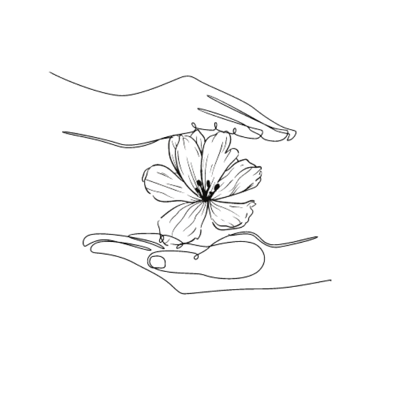

# Todo App Flores del Tambo

Full Stack Application made with React, Node.js, Express and MongoDB.

This To do App allows users to add, edit and delete tasks as well as see the whole list.

Users can also view the tasks they have completed and those they have deleted in a pop-up window.

## To do list

[Live Demo](https://mern-flores-tambo.herokuapp.com/)

## Front-End Installation

1. `cd app`
2. `npm install`
3. `npm start`

## Back-End Installation

1. `cd backend`
2. `npm install`
3. `npm install --save express`
4. `npm install --save mongoose`
5. `node index`

## Team

- Marcela Beltrán
- Juan Casas
- Angie Ladino
- Mateo Patarroyo
- Valeria Ziegler
